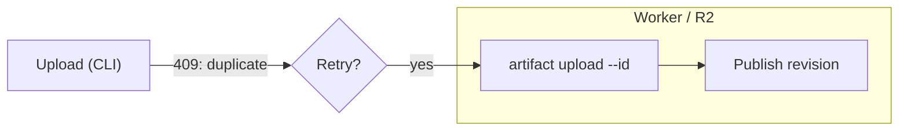
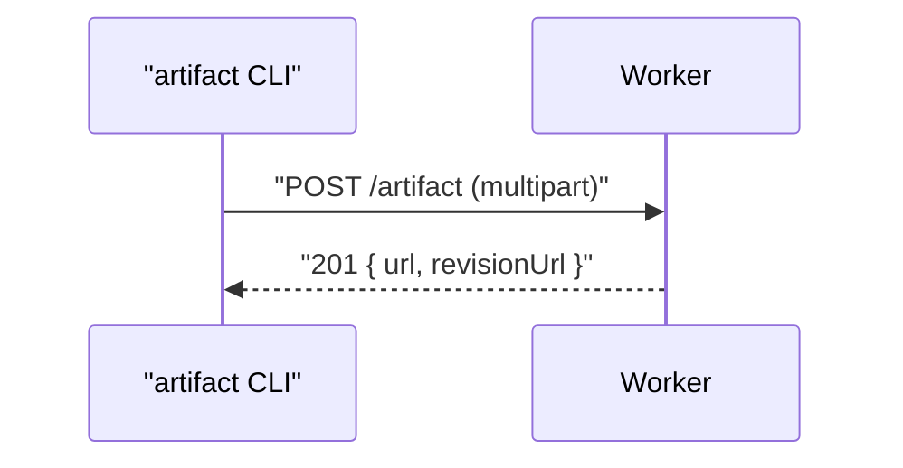

# Mermaid rendering (required)

Every artifact this skill ships must load Mermaid from cdnjs and render
diagrams client-side. Do not leave raw `flowchart` / `sequenceDiagram` source
as plain `<pre>` without the Mermaid runtime.

## CDN pin

```html
<script src="https://cdnjs.cloudflare.com/ajax/libs/mermaid/11.12.0/mermaid.min.js"
  crossorigin="anonymous" referrerpolicy="no-referrer"></script>
```

## Markup

Use a `<pre class="mermaid">` (or `<div class="mermaid">`) with the diagram
source as text content. Prefer wrapping in a `<figure>` with a caption.

```html
<figure>
  <pre class="mermaid">flowchart LR
  A["Author"] --> B["Upload"]
  B --> C["Public URL"]
</pre>
  <figcaption>Publish path</figcaption>
</figure>
```

## Always double-quote label text

Wrap **all** human-readable text in `"` double quotes — node labels, edge
labels, subgraph titles, sequence participants/messages, state descriptions.
Unquoted ASCII punctuation (`(` `)` `[` `]` `{` `}` `:` `;` `/` `<` `>` `&`…)
breaks the Mermaid parser or gets mis-tokenized as shape/direction syntax.





Rules:

- `A["text"]`, `A("text")`, `A{"text"}` — quote inside the shape brackets
- Edge labels: `-->|"text"|` or `-- "text" -->`
- Subgraph titles: `subgraph id ["Title"]`
- If the text itself contains `"`, use the HTML entity `&quot;`
- Quote even when it looks safe — labels get edited later and break silently

Supported diagram kinds (use freely when they clarify the review):

- `flowchart` / `graph`
- `sequenceDiagram`
- `classDiagram`
- `stateDiagram-v2`
- `erDiagram`
- `gantt`
- `pie`
- `mindmap` (when Mermaid 11 supports it in this pin)

## Init rules (multi-doc shells)

Hidden articles use `display: none`. `startOnLoad: true` mis-measures those
nodes. Always:

1. Stash each node's text into `data-mermaid-source` before the first render
2. `mermaid.initialize({ startOnLoad: false, theme, themeVariables })` using
   dark or light Tokyo Night vars from `tokyo-night.md`
3. Call `mermaid.run({ nodes })` for the **visible** doc after show
4. Skip nodes that already have `data-processed`
5. On theme toggle: restore text from `data-mermaid-source`, clear
   `data-processed`, re-`initialize`, then `run` the active doc

```js
mermaid.initialize({
  startOnLoad: false,
  theme: isDark ? "dark" : "base",
  securityLevel: "strict",
  themeVariables: isDark ? tokyoNightDark : tokyoNightLight,
});

function renderMermaid(root) {
  const nodes = [...root.querySelectorAll("pre.mermaid, .mermaid")]
    .filter((n) => !n.getAttribute("data-processed"));
  if (!nodes.length) return;
  return mermaid.run({ nodes });
}
```

Call `renderMermaid(activeArticle)` from the doc-switcher and once on boot for
the initially active article.

## Theme

Pair Mermaid with the shell theme: `theme: "dark"` + high-contrast Tokyo Night
variables in dark mode; `theme: "base"` + Tokyo Night Light variables in light
mode. Copy exact hex maps from `tokyo-night.md`. Do not use Mermaid's default
light pastel palette.

## Eval checks

When eval/evidence is requested, assert at least one `.mermaid svg` exists in
the Playwright page before screenshotting:

```js
await page.waitForSelector(".mermaid svg", { timeout: 5000 });
```

## Anti-patterns

- Shipping diagram source without the Mermaid script tag
- `startOnLoad: true` alone in a multi-doc `display:none` shell
- Loading Mermaid from jsDelivr / unpkg
- Putting Mermaid source inside `<code>` (highlight.js will steal it)
- Theme toggle that leaves stale Mermaid SVGs from the previous palette
- Unquoted labels containing `(` `)` `:` `/` etc. — always double-quote label
  text
